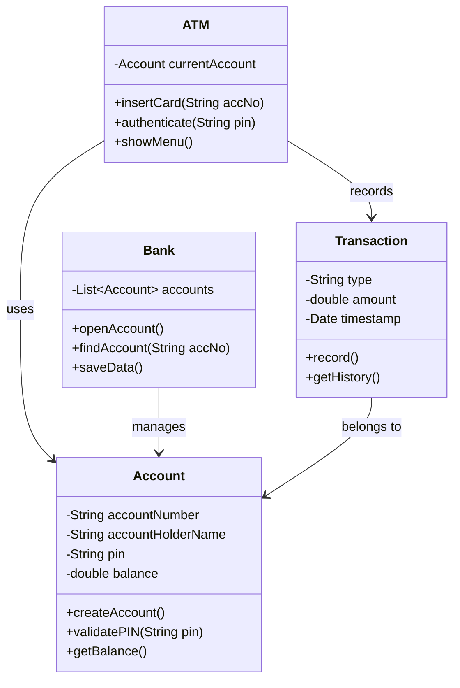

<div align="center">

```
 █████╗ ████████╗███╗   ███╗    ███████╗██╗███╗   ███╗
██╔══██╗╚══██╔══╝████╗ ████║    ██╔════╝██║████╗ ████║
███████║   ██║   ██╔████╔██║    ███████╗██║██╔████╔██║
██╔══██║   ██║   ██║╚██╔╝██║    ╚════██║██║██║╚██╔╝██║
██║  ██║   ██║   ██║ ╚═╝ ██║    ███████║██║██║ ╚═╝ ██║
╚═╝  ╚═╝   ╚═╝   ╚═╝     ╚═╝    ╚══════╝╚═╝╚═╝     ╚═╝

███████╗██╗   ██╗███████╗████████╗███████╗███╗   ███╗
██╔════╝╚██╗ ██╔╝██╔════╝╚══██╔══╝██╔════╝████╗ ████║
███████╗ ╚████╔╝ ███████╗   ██║   █████╗  ██╔████╔██║
╚════██║  ╚██╔╝  ╚════██║   ██║   ██╔══╝  ██║╚██╔╝██║
███████║   ██║   ███████║   ██║   ███████╗██║ ╚═╝ ██║
╚══════╝   ╚═╝   ╚══════╝   ╚═╝   ╚══════╝╚═╝     ╚═╝
```

### 💳 Insert card. Enter PIN. Execute transactions. — Built in Java, Powered by OOP.

<br/>

[](https://www.java.com/)
[](https://github.com/aarav12e/Atm_Simulation_System)
[](https://github.com/aarav12e/Atm_Simulation_System)
[](https://netbeans.apache.org/)

<br/>

[](https://github.com/aarav12e/Atm_Simulation_System/stargazers)
[](https://github.com/aarav12e/Atm_Simulation_System)
[](./src/ASimulatorSystem/)

</div>

---

## 💳 What is This?

**ATM Simulation System** is a Java console application that simulates a real-world ATM banking environment. Built entirely with **Object-Oriented Programming** principles, it lets users open bank accounts, log in securely, and perform core banking operations — all from the terminal.

> Deposit. Withdraw. Check Balance. Transfer. All from your keyboard.

---

## 🏧 ATM Terminal — Live Preview

```
  ╔══════════════════════════════════════════════════════╗
  ║           WELCOME TO ATM SIMULATION SYSTEM           ║
  ║                  aarav12e © 2025                     ║
  ╠══════════════════════════════════════════════════════╣
  ║                                                      ║
  ║   [1]  Create New Account                           ║
  ║   [2]  Login to Account                             ║
  ║   [3]  Exit                                         ║
  ║                                                      ║
  ╠══════════════════════════════════════════════════════╣
  ║  Enter your choice: _                               ║
  ╚══════════════════════════════════════════════════════╝

         ↓ After Login ↓

  ╔══════════════════════════════════════════════════════╗
  ║           MAIN MENU — Account: XXXX-XXXX             ║
  ╠══════════════════════════════════════════════════════╣
  ║                                                      ║
  ║   [1]  Deposit Money             💰                  ║
  ║   [2]  Withdraw Money            💸                  ║
  ║   [3]  Check Balance             📊                  ║
  ║   [4]  Transfer Funds            🔁                  ║
  ║   [5]  Transaction History       📋                  ║
  ║   [6]  Change PIN                🔑                  ║
  ║   [7]  Logout                    🚪                  ║
  ║                                                      ║
  ╚══════════════════════════════════════════════════════╝
```

---

## ⚙️ System Architecture



---

## 🔄 Transaction Flow Pipeline

```
  👤  User Starts Program
           │
           ▼
  ┌──────────────────────┐
  │   Main Menu          │
  │   1. Create Account  │
  │   2. Login           │
  │   3. Exit            │
  └────────┬─────────────┘
           │
     ┌─────┴──────┐
     ▼            ▼
  CREATE        LOGIN
  ACCOUNT       ────────────────────────────────────┐
     │                                              │
     ▼                                              ▼
  ┌──────────────────────┐              ┌───────────────────────┐
  │  Enter Name          │              │  Enter Account Number │
  │  Set PIN             │              │  Enter PIN            │
  │  Initial Deposit     │              │  ✅ Authenticated     │
  │  Account # Generated │              └──────────┬────────────┘
  └──────────────────────┘                         │
                                                   ▼
                                    ┌──────────────────────────────┐
                                    │        TRANSACTION MENU      │
                                    ├──────────────────────────────┤
                                    │                              │
                                    ├──→  💰 DEPOSIT               │
                                    │     Enter amount → Balance++ │
                                    │                              │
                                    ├──→  💸 WITHDRAW              │
                                    │     Check funds → Balance--  │
                                    │     ❌ Insufficient: Denied  │
                                    │                              │
                                    ├──→  📊 CHECK BALANCE         │
                                    │     Display current balance  │
                                    │                              │
                                    ├──→  🔁 TRANSFER              │
                                    │     Find target account      │
                                    │     Debit self → Credit other│
                                    │                              │
                                    ├──→  📋 HISTORY               │
                                    │     List all transactions    │
                                    │                              │
                                    ├──→  🔑 CHANGE PIN            │
                                    │     Verify old → Set new     │
                                    │                              │
                                    └──→  🚪 LOGOUT                │
                                          Clear session → Main Menu│
                                    └──────────────────────────────┘
```

---

## ✨ Features

| Feature | Description | Status |
|---------|-------------|--------|
| 🏦 **Account Creation** | Open a new bank account with name, PIN, initial deposit | ✅ |
| 🔐 **PIN Authentication** | Secure login using account number + PIN | ✅ |
| 💰 **Deposit** | Add funds to your account balance | ✅ |
| 💸 **Withdraw** | Withdraw with insufficient funds protection | ✅ |
| 📊 **Balance Enquiry** | Real-time balance display | ✅ |
| 🔁 **Fund Transfer** | Transfer money between accounts | ✅ |
| 📋 **Transaction History** | Full log of all operations | ✅ |
| 🔑 **Change PIN** | Secure PIN update with old PIN verification | ✅ |
| 🚪 **Session Management** | Safe logout clearing active session | ✅ |

---

## 🏗️ Project Structure

```
Atm_Simulation_System/
│
├── 📂 src/
│   └── 📂 ASimulatorSystem/        ← Main Java package
│       ├── ASimulatorSystem.java   ← Entry point (main method)
│       ├── Account.java            ← Account model + operations
│       ├── ATM.java                ← ATM controller logic
│       ├── Bank.java               ← Account registry & management
│       └── Transaction.java        ← Transaction record model
│
├── 📂 build/
│   └── 📂 classes/                 ← Compiled .class files (auto-generated)
│
├── 📂 nbproject/                   ← NetBeans project config
│   ├── build-impl.xml
│   ├── project.properties
│   └── project.xml
│
├── 📄 build.xml                    ← Apache Ant build script
├── 📄 manifest.mf                  ← JAR manifest file
└── 📄 README.md
```

---

## 🧠 OOP Concepts Applied

This project is a solid demonstration of core Java OOP principles:

```
  OBJECT-ORIENTED PROGRAMMING
  ─────────────────────────────────────────────────────
  
  ✅ ENCAPSULATION
     Account fields (balance, PIN) are private.
     Accessed only via getters/setters.
     → Data is protected from direct manipulation.

  ✅ ABSTRACTION
     ATM class abstracts complex banking logic.
     User interacts through simple menu options.
     → Internal implementation hidden from user.

  ✅ INHERITANCE
     Transaction types (Deposit, Withdraw, Transfer)
     can extend a base Transaction class.
     → Code reuse & hierarchy.

  ✅ POLYMORPHISM
     Different transaction types handled uniformly
     through method overriding.
     → Single interface, multiple behaviors.
  
  ─────────────────────────────────────────────────────
```

---

## 🚀 Getting Started

### Prerequisites

```bash
java -version    # JDK 8 or above required
javac -version   # Java compiler must be available
```

### Option 1 — Run via Command Line

```bash
# 1. Clone the repository
git clone https://github.com/aarav12e/Atm_Simulation_System.git
cd Atm_Simulation_System

# 2. Compile the Java source files
javac -d build/classes src/ASimulatorSystem/*.java

# 3. Run the application
java -cp build/classes ASimulatorSystem.ASimulatorSystem
```

### Option 2 — Run via Apache Ant

```bash
# Build using the included build.xml
ant build

# Run using ant
ant run
```

### Option 3 — Open in NetBeans (Recommended)

```
1. Open NetBeans IDE
2. File → Open Project
3. Navigate to Atm_Simulation_System/
4. Click Open Project
5. Press F6 (or Run → Run Project)
```

---

## 🧪 Sample Session

```
$ java -cp build/classes ASimulatorSystem.ASimulatorSystem

╔══════════════════════════════════════╗
║     ATM SIMULATION SYSTEM v1.0      ║
╠══════════════════════════════════════╣
║  1. Create Account                  ║
║  2. Login                           ║
║  3. Exit                            ║
╚══════════════════════════════════════╝
> 1

Enter your full name   : Aarav Kumar
Set a 4-digit PIN      : ****
Initial deposit (₹)    : 5000

✅ Account created successfully!
   Account Number : 4827-1093
   Balance        : ₹5,000.00

╔══════════════════════════════════════╗
║  TRANSACTION MENU — Aarav Kumar     ║
╠══════════════════════════════════════╣
║  1. Deposit     4. Transfer         ║
║  2. Withdraw    5. History          ║
║  3. Balance     6. Change PIN       ║
║                 7. Logout           ║
╚══════════════════════════════════════╝
> 2

Enter withdrawal amount (₹): 1500
✅ Withdrawal successful.
   Withdrawn : ₹1,500.00
   Balance   : ₹3,500.00
```

---

## 💡 Key Java Concepts Used

```java
// Encapsulation — private fields with controlled access
public class Account {
    private String accountNumber;
    private double balance;
    private String pin;

    public double getBalance() { return balance; }
    public boolean validatePIN(String input) {
        return this.pin.equals(input);
    }
}

// Input handling — Scanner for console interaction
Scanner sc = new Scanner(System.in);
System.out.print("Enter amount: ");
double amount = sc.nextDouble();

// Conditional logic — overdraft protection
if (amount > balance) {
    System.out.println("❌ Insufficient funds.");
} else {
    balance -= amount;
    System.out.println("✅ Withdrawal successful.");
}
```

---

## 🛠️ Tech Stack

| Technology | Role |
|-----------|------|
|  | Core language — 100% of the codebase |
|  | Encapsulation, Abstraction, Inheritance, Polymorphism |
|  | IDE + project scaffolding |
|  | Build automation via `build.xml` |
|  | Console I/O handling |
|  | Account registry & transaction history |

---

## 🎯 Who Is This For?

This project is perfect if you're:

- 🎓 A **CS/B.Tech student** learning Java OOP for the first time
- 💼 Preparing for **Java placements & interviews** (OOP questions are evergreen)
- 🔨 Building a **Java project portfolio** from scratch
- 📚 Studying **class design, data modeling**, and console I/O in Java

---

## 🤝 Contributing

```bash
# Fork → Clone → Branch
git checkout -b feature/add-mini-statement

# Make changes → Commit
git commit -m "feat: add mini statement with last 5 transactions"

# Push → Open PR
git push origin feature/add-mini-statement
```

---

## 👨‍💻 Author

<div align="center">

**Aarav Kumar**
*Java Developer · B.Tech CDS (2028) · Ignite Club*

[](https://github.com/aarav12e)

</div>

---

<div align="center">

```
╔════════════════════════════════════════════════════╗
║                                                    ║
║   TRANSACTION COMPLETE. PLEASE TAKE YOUR CARD.    ║
║                                                    ║
╚════════════════════════════════════════════════════╝
```

*Built with ☕ Java — OOP principles in every class*

**`< / ASimulatorSystem >`**

</div>
